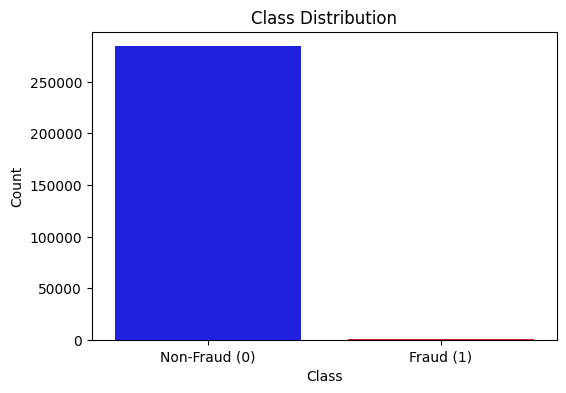
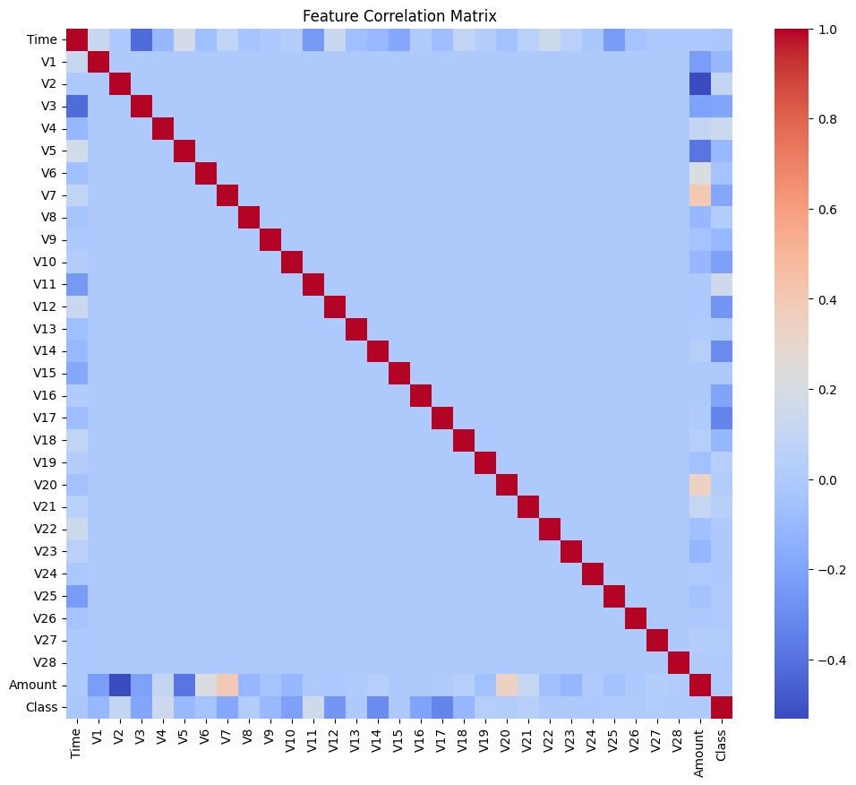
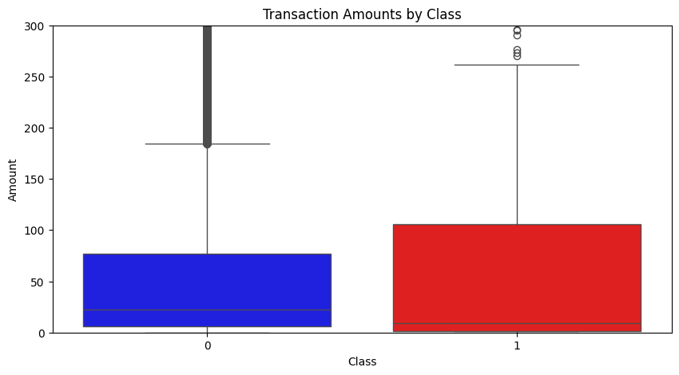
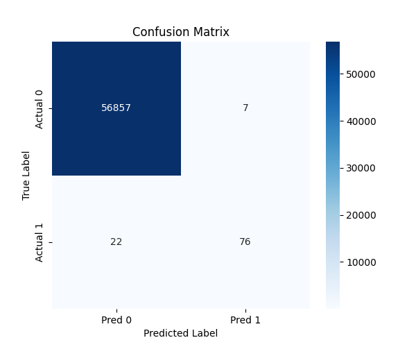
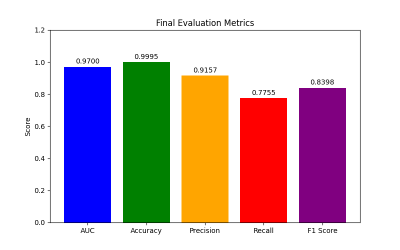

# Credit Card Fraud Detection

An advanced machine learning system for detecting fraudulent credit card transactions using Random Forest classification with optimized threshold selection and comprehensive feature engineering.

## Project Structure

```
credit-card-fraud-detection/
├── README.md                  # Project documentation
├── requirements.txt           # Package dependencies
├── config.py                  # Configuration parameters
├── main.py                    # Main execution script
├── preprocessing.py           # Data loading and preprocessing
├── model.py                   # Model training and evaluation
├── utils.py                   # Utility functions
├── tests/                     # Unit tests
│   ├── __init__.py
│   ├── test_preprocessing.py
│   └── test_model.py
├── data/                      # Data directory
│   └── creditcard.csv         # Dataset (not included)
├── models/                    # Saved models
└── results/                   # Results and visualizations
    ├── class_distribution.png       # Distribution of fraud vs normal transactions
    ├── feature_correlation_matrix.png # Feature correlation heatmap
    ├── transaction_amounts_by_class.png # Transaction amounts comparison
    ├── confusion_matrix.png   # Confusion matrix visualization
    └── metrics_bar_chart.png  # Performance metrics visualization
```

## Features

- **Advanced Feature Engineering**:
  - Temporal features extraction
  - Amount-based anomaly detection
  - Interaction features
  - Outlier detection

- **Robust Preprocessing**:
  - Multiple sampling strategies (SMOTE, SMOTEENN, ADASYN)
  - Outlier handling with robust scaling
  - Dimensionality reduction
  - Feature correlation analysis

- **Optimized Model Training**:
  - Random Forest with balanced class weights
  - Threshold optimization using precision-recall curves
  - F1 score optimization

- **Comprehensive Evaluation**:
  - Precision, recall, F1 score metrics
  - ROC AUC evaluation
  - Confusion matrix analysis

## Installation

1. Clone the repository:
   ```bash
   git clone https://github.com/yourusername/credit-card-fraud-detection.git
   cd credit-card-fraud-detection
   ```

2. Create a virtual environment and activate it:
   ```bash
   python -m venv venv
   source venv/bin/activate  # On Windows: venv\Scripts\activate
   ```

3. Install the required dependencies:
   ```bash
   pip install -r requirements.txt
   ```

## Usage

1. Place your credit card dataset in the `data/` directory as `creditcard.csv`

2. Run the main script:
   ```bash
   python main.py
   ```

## Data Requirements

The project requires a CSV file with the following columns:
- `Time`: Seconds elapsed between transactions
- `Amount`: Transaction amount
- `V1` through `V28`: PCA-transformed features
- `Class`: Target variable (1 for fraud, 0 for legitimate)

You can obtain similar datasets from:
- [Kaggle Credit Card Fraud Detection](https://www.kaggle.com/datasets/mlg-ulb/creditcardfraud)

## Exploratory Data Analysis

The project includes exploratory data analysis visualizations to better understand the characteristics of credit card fraud:

- **Class Distribution**: Shows the severe imbalance between fraudulent and normal transactions



- **Feature Correlation Matrix**: Visualization of correlations between features



- **Transaction Amounts by Class**: Comparison of transaction amounts between fraudulent and legitimate transactions



## Results Visualization

The project generates visual representations of model performance:

- **Confusion Matrix**: Visual representation of the model's true positives, false positives, true negatives, and false negatives



- **Metrics Bar Chart**: Bar chart comparing key performance metrics (AUC, accuracy, precision, recall, F1 score)



## License

[MIT License](LICENSE)